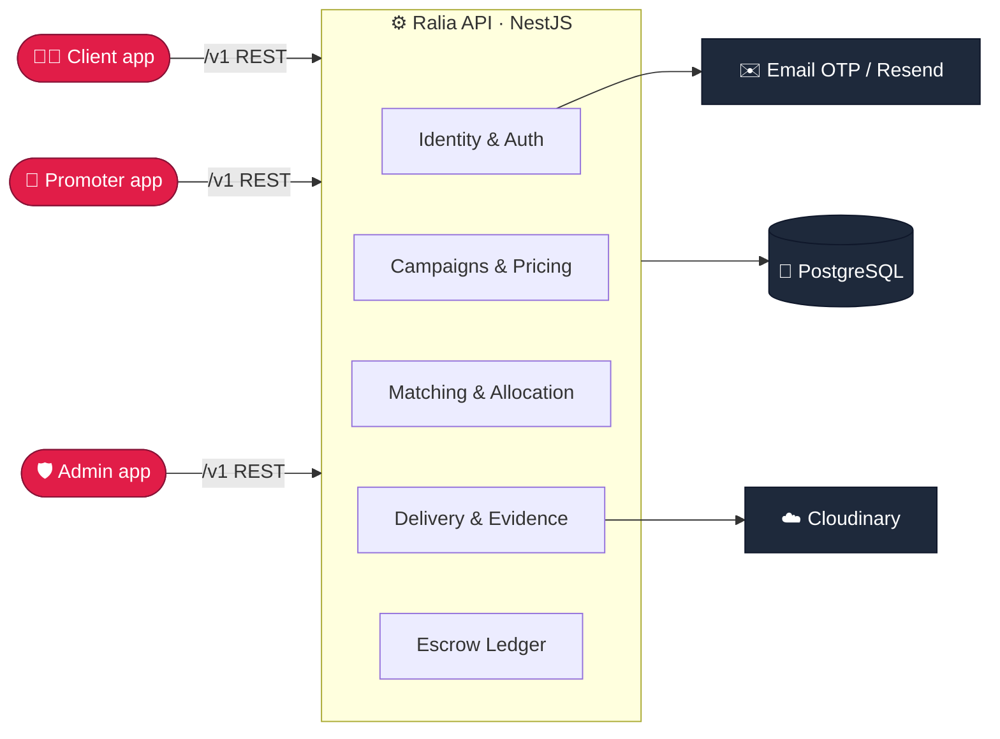
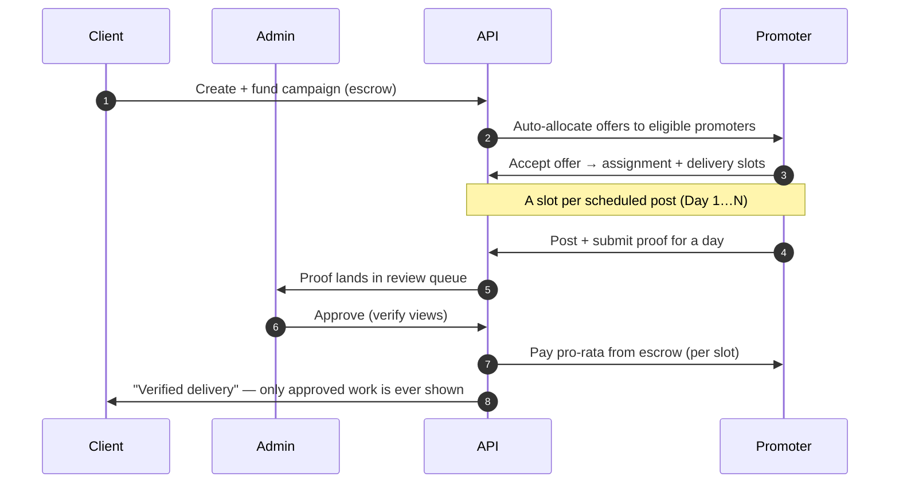
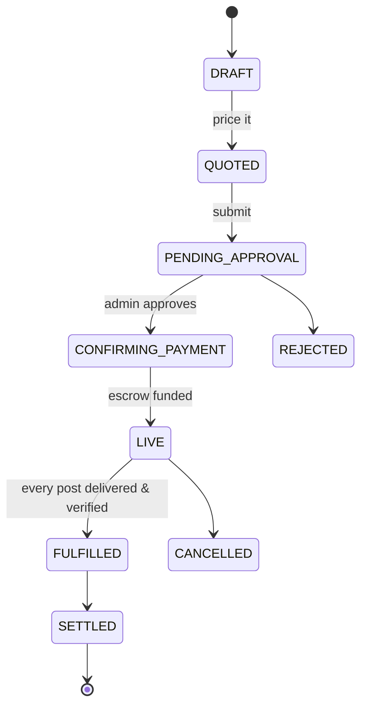

<div align="center">

# ⚙️ Ralia API

### The engine behind the Ralia promoter marketplace — matching, money, and proof.

<br/>


</div>

---

Ralia connects **businesses** who want reach with **promoters** who have an audience. A client
books a campaign; the platform matches eligible promoters, sends offers, tracks the posts they
make, verifies the proof, and settles pay — pro-rata on what was actually delivered. This service
owns all of that: identity, matching, the escrow ledger, and the delivery lifecycle.

## 🧭 System at a glance



## 🔄 The delivery loop (this is the product)



> **Integrity rule:** a client only ever hears about **approved** work. Nothing a promoter does
> reaches the client until an admin has verified it.

## 📈 Campaign lifecycle



## 🧱 Module map

| Domain | Modules |
|---|---|
| **Identity** | `identity` (auth, email OTP, sessions) · `profiles` |
| **Campaigns** | `campaigns` (wizard, pricing, quote) · `clients` |
| **Matching** | `matching` (offers, fit score, accept) · `allocation` (auto-allocate, reclaim, re-allocation) · `scoring` |
| **Delivery** | `evidence` (proof + perceptual-hash dedupe) · `files` (provider-agnostic storage) · `tracking` (click links) |
| **Money** | `ledger` (double-entry escrow) · `wallet` · `payments` |
| **Ops** | `admin` (review, RBAC, reconciliation) · `analytics` · `notifications` |

<details>
<summary><b>💰 How money is kept honest</b></summary>

- A campaign is a fixed escrow: `slot_price × slots × posts`.
- A **slot** is priced from what the client funded, not the promoter's channel size — so payouts
  are always bounded by escrow.
- Settlement is **per delivered post**, pro-rata on verified reach vs the priced target; there is
  **no client refund** — Ralia retains any undelivered remainder.
- Every money- or score-affecting write lands a double-entry ledger row + an audit record in the
  same transaction.
</details>

<details>
<summary><b>🗓️ Multi-day campaigns</b></summary>

A campaign can require **N posts over a run window** (one-off, daily, weekly, or custom). On accept,
the assignment fans out into **delivery slots** (Day 1…N), each with its own internal deadline
(a contingency buffer *before* the client's expectation). A single missed day forfeits that day's
pay; **two missed days in a row** re-allocate the remaining posts to a fresh promoter.
</details>

## 🚀 Quickstart

```bash
npm install
cp .env.example .env            # then fill in the secrets
npm run prisma:migrate          # apply migrations to your local Postgres
npm run seed                    # optional: demo users + campaigns
npm run start:dev               # http://localhost:6100
```

<details>
<summary><b>🔐 Environment</b></summary>

Copy `.env.example` and set at minimum: `DATABASE_URL`, the `JWT_*` secrets,
`FIELD_ENCRYPTION_KEY` (`openssl rand -hex 32`, exactly 64 hex chars),
`STORAGE_PROVIDER` + `CLOUDINARY_URL`, `MAIL_TRANSPORT`, and `OTP_TRANSPORT=email`.
Full deploy checklist lives in the workspace `DEPLOY.md`.
</details>

<details>
<summary><b>🛠️ Scripts</b></summary>

| Script | Does |
|---|---|
| `start:dev` | watch-mode dev server |
| `start:prod` | `node dist/main` (production) |
| `build` | `nest build` → `dist/` |
| `test` | Jest suite (21 suites · 335 tests) |
| `prisma:migrate` / `prisma:deploy` | dev / prod migrations |
| `seed` | seed demo data |
</details>

## 🧪 Testing

```bash
npm test          # all suites
npm run test:cov  # with coverage
```

## 🚢 Deployment

Runs on **Railway** (Nixpacks) with managed Postgres — `railway.json` builds and runs
`prisma migrate deploy && node dist/main.js` on every deploy. See `DEPLOY.md`.

---

<div align="center">
<sub>Part of Ralia · <a href="../ralia-client">Client</a> · <a href="../ralia-admin">Admin</a> · <a href="../ralia-promoter">Promoter</a></sub>
</div>
